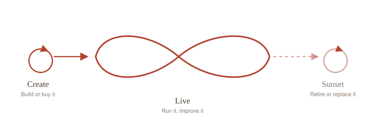

<!-- Banner -->

  

<h1 align="center">Digital Lifecycle Guide (draft)</h1>

  <strong>A guide for the people who run Government of Canada digital services, across the whole life of a service:</strong> 
  from before it exists, through running and maturing it, to retiring or replacing it well.

  

     

> **This is a mockup, not official guidance.** It is a working draft for exploring how this kind of guidance could read. When it names an official gate or rule, it points to where the real thing lives (Public Services and Procurement Canada, the Directive on the Management of Procurement, CanadaBuys, Library and Archives Canada, and others). It does not replace them.

---

## Why we made it

We kept noticing the same thing. A team works hard to get a service built and launched, and then the guidance runs out. The service goes on living for years after that. It has to be funded again every year, kept secure, improved as people's needs change, and one day retired or replaced. Almost nothing tells the person in charge how any of that works.

So we wanted one guide that follows a service the whole way through its life, written plainly, for the person accountable for it rather than the people building it. When it reaches an official gate or a rule, it does not try to be the rule. It shows you the step, and it points you to where the real thing lives.

## How it works

The guide is organised two ways at once.

- **Three phases.** **Create** covers the idea and the build. **Live** covers running the service and maturing it. **Sunset** covers retiring or replacing it. Each phase has its own sub-phases, like Discovery, Alpha, and Beta in Create.
- **Topics that run through every phase.** Funding, procurement and contracting, security, privacy, accessibility, data stewardship, monitoring, user research, and more. Each one is followed from the start of a service to its end.

A **gate map** ties it together: it walks through the official approvals a service passes, from the first idea to retirement, and names who owns each one. It uses a grants and contributions system as the worked example that other services can adapt from.

## What's inside

- A walk through a service's life, phase by phase.
- Topic pages that state each duty plainly and link to the official source behind it.
- Reference pieces, including a worked sample contract and an options analysis.
- The gate map of approvals, from the first idea to retirement.

## Where to find it

Live mockup: **https://myermcat.github.io/digital-lifecycle-guide/**

The final version will live on GCXchange.

## Status

An early draft and research preview. The content, the structure, and the visuals are all still changing, and nothing here is final or authoritative yet.

## Built with

React and TanStack Start, styled with Tailwind, authored in [Lovable](https://lovable.dev) for the visual components and Cursor for the text and structure, and deployed to GitHub Pages.
